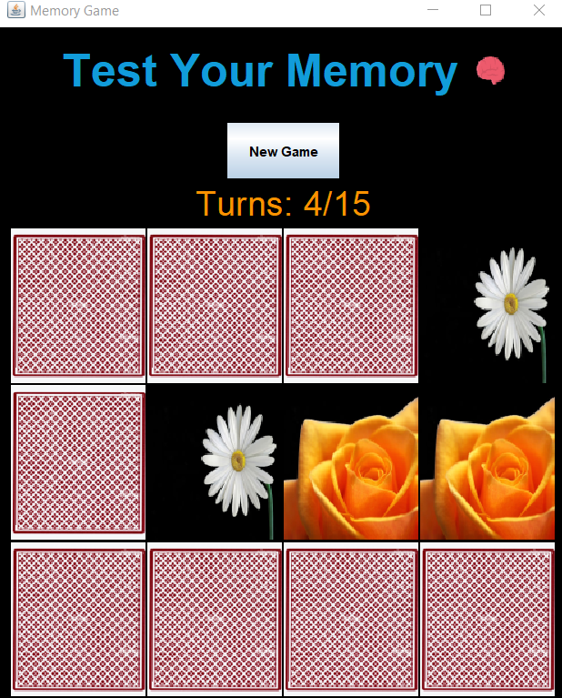

# Memory Game in Java Swing and AWT

This project is a memory game implemented in Java using Swing and AWT components. It challenges players to test their memory and recall abilities by matching pairs of cards.



## Features

- Graphical user interface built with Java Swing and AWT.
- Players can match pairs of cards to test their memory skills.
- Turn counter keeps track of the number of turns taken.
- "New Game" button to reset and reshuffle the icons.

## Setup

To run the Memory Game project locally, follow these steps:

1. Clone the repository:
   ```bash
   git clone https://github.com/invictus-21/Memory-Game.git
   ```
2. Navigate to the project directory:
   ```bash
   cd Memory-Game
   ```
3. Run the script:
   ```bash
   script.sh
   ```

## Usage

- Upon running the application, the memory game grid will be displayed with default image icons.
- Click on a tile to flip it and reveal an image icon.
- Try to find all matching pairs within 15 turns.
- Use the "New Game" button to reset and reshuffle the icons for a new game.